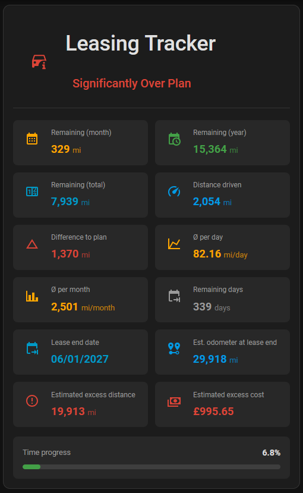

# 🚗 Leasing Tracker Card

A custom Lovelace card for the Leasing Tracker integration.

<p align="center">
  
</p>

<p align="center">
  <a href="https://github.com/foxxxhater/leasing-tracker/releases">
    
  </a>
  <a href="LICENSE">
    
  </a>
  <a href="https://github.com/hacs/integration">
    
  </a>
</p>

**🌐 Language / Sprache:** [🇬🇧 English](#-english) · [🇩🇪 Deutsch](#-deutsch)

---

# 🇬🇧 English

## 📸 Screenshots

<p align="left">
  
</p>

- 1st version on my test system

<p align="right">
  
</p>

- On my live system

## ✨ Features

- 🔍 **Smart sensor detection** - Automatically finds all sensors of a Leasing Tracker vehicle
- 🚗 **Multiple vehicles** - One card per vehicle
- 🎨 **Color coding** - Green/Yellow/Red status
- 📱 **Responsive** - Works everywhere
- ⚙️ **Graphical editor** - Configure everything with clicks, no YAML required

## ⚠️ Important

This card requires the <a href="https://github.com/foxxxhater/leasing-tracker">**Leasing Tracker Integration**</a>!

Install the integration first, then this card.

## 🔍 How does the sensor detection work?

### One entity - all data!

You only provide **one** entity - the status sensor:
```yaml
entity: sensor.my_leasing_status
```

The card then **automatically** finds all other sensors of the same vehicle.

**How?** The card determines the device of the status sensor and reads all
associated sensors directly from the device registry. This is
**language- and rename-proof** - it doesn't matter whether the sensors are
named in German, English or Dutch, or whether you renamed them.

> **Note:** Older card versions (< 1.2.0) searched for the sensors by their
> names. With the new Leasing Tracker integration this no longer works
> reliably - therefore the device registry is used from v1.2.0 onwards.

### Debug: What was found?

Open the browser console (F12) and look for:
```
Leasing Tracker Card - Gefundene Sensoren: {...}
```

There you can see which sensors the card has found.

## 🚗 Multiple leasing contracts

### Each contract = its own card

**Example: You have 2 cars**

#### Car 1: BMW Leasing
Integration config: Name = "BMW Leasing"
→ Creates sensors with prefix: `bmw_leasing_`

```yaml
type: custom:leasing-tracker-card
entity: sensor.bmw_leasing_status
title: BMW 3 Series
```

#### Car 2: Audi Leasing
Integration config: Name = "Audi Leasing"
→ Creates sensors with prefix: `audi_leasing_`

```yaml
type: custom:leasing-tracker-card
entity: sensor.audi_leasing_status
title: Audi A4
```

### Dashboard with both

```yaml
type: vertical-stack
cards:
  - type: custom:leasing-tracker-card
    entity: sensor.bmw_leasing_status
    title: BMW 3 Series

  - type: custom:leasing-tracker-card
    entity: sensor.audi_leasing_status
    title: Audi A4
```

### Or side by side

```yaml
type: horizontal-stack
cards:
  - type: custom:leasing-tracker-card
    entity: sensor.bmw_leasing_status
    title: BMW 3 Series

  - type: custom:leasing-tracker-card
    entity: sensor.audi_leasing_status
    title: Audi A4
```

## 📦 Installation

### Via HACS (recommended)

1. HACS → Frontend → ⋮ → Custom repositories
2. URL: `https://github.com/foxxxhater/leasing-tracker-card`
3. Category: Dashboard
4. Install
5. Clear browser cache (Ctrl + F5)

### Manual

1. Download `leasing-tracker-card.js`
2. Copy the file to `/config/www/leasing-tracker-card/` - create the path if necessary
3. Register the resource:
   - Settings → Dashboards → ⋮ → Resources
   - URL: `/local/leasing-tracker-card/leasing-tracker-card.js`
   - Type: JavaScript Module
4. Restart Home Assistant
5. Clear browser cache (Ctrl + Shift + R)

## ⚙️ Configuration

### Via YAML

**Minimal:**
```yaml
type: custom:leasing-tracker-card
entity: sensor.my_leasing_status
```

**With title:**
```yaml
type: custom:leasing-tracker-card
entity: sensor.my_leasing_status
title: My BMW 3 Series
```

**Only important sensors:**
```yaml
type: custom:leasing-tracker-card
entity: sensor.my_leasing_status
title: My Car
show_km_remaining_month: true
show_km_difference: true
show_progress: true
show_km_remaining_year: false
show_km_driven: false
show_average_day: false
```

## 🎛️ Options

| Option | Default | Description |
|--------|---------|-------------|
| `entity` | **required** | Status sensor |
| `title` | `Leasing Tracker` | Title |
| `show_title` | `true` | Show/hide title |
| `show_status` | `true` | Show/hide status badge |
| `show_km_remaining_month` | `true` | Remaining (month) |
| `show_km_remaining_year` | `true` | Remaining (year) |
| `show_km_remaining_total` | `true` | Remaining (total) |
| `show_km_driven` | `true` | Distance driven |
| `show_km_difference` | `true` | Difference to plan |
| `show_average_day` | `true` | Ø per day |
| `show_average_month` | `true` | Ø per month |
| `show_remaining_days` | `true` | Remaining days |
| `show_progress` | `true` | Progress bar |
| `columns` | `2` | Number of columns (desktop) |
| `columns_mobile` | `1` | Number of columns (mobile, < 600px) |
| `metric_background` | - | Background color of the individual tiles |
| `metric_background_hover` | - | Background color on mouse hover |

> **Tip:** From v1.2.0 onwards all options can also be set conveniently in the
> **graphical editor** - including selecting the status sensor via dropdown.

## 🎨 Color coding

### Status
- 🟢 **On Plan** - Green
- 🟡 **Over Plan** - Yellow
- 🔴 **Significantly Over Plan** - Red

### Remaining distance
- 🟢 **> 500 km** - Green
- 🟡 **0-500 km** - Yellow
- 🔴 **< 0 km** - Red

### Difference
- 🟢 **< 0** - Under plan
- 🟡 **0-1000** - Slightly over plan
- 🔴 **> 1000** - Significantly over plan

## 💡 Examples

### Dashboard for a company car fleet

```yaml
type: grid
columns: 3
cards:
  - type: custom:leasing-tracker-card
    entity: sensor.car_1_leasing_status
    title: Car 1

  - type: custom:leasing-tracker-card
    entity: sensor.car_2_leasing_status
    title: Car 2

  - type: custom:leasing-tracker-card
    entity: sensor.car_3_leasing_status
    title: Car 3
```

### Compact overview

```yaml
type: custom:leasing-tracker-card
entity: sensor.my_leasing_status
show_km_remaining_month: true
show_km_difference: true
show_progress: true
# Hide everything else
show_km_remaining_year: false
show_km_remaining_total: false
show_km_driven: false
show_average_day: false
show_average_month: false
show_remaining_days: false
```

## 📊 Documentation

- [📝 Changelog](CHANGELOG.md)

## 🤝 Compatibility

- **Home Assistant:** 2023.x+
- **Leasing Tracker Integration:** v1.1.3+

## Tested with:
- **Core:** 2026.1.2 and 2026.1.3
- **Supervisor:** 2026.01.1
- **OS:** 16.x and 17.0
- **Frontend:** 20260107.2

## Support

[GitHub Repository](https://github.com/foxxxhater/leasing-tracker-card)
[Documentation](https://github.com/foxxxhater/leasing-tracker-card#readme)
[Issues](https://github.com/foxxxhater/leasing-tracker-card/issues)

## 📄 License

MIT License

---

# 🇩🇪 Deutsch

## 📸 Screenshots

<p align="left">
  
</p>

- 1. Version auf meinem Test System

<p align="right">
  
</p>

- Auf meinem Live System

## ✨ Features

- 🔍 **Intelligente Sensor-Suche** - Findet automatisch alle Sensoren eines Leasing-Tracker-Fahrzeugs
- 🚗 **Mehrere Fahrzeuge** - Eine Card pro Fahrzeug
- 🎨 **Farbcodierung** - Grün/Gelb/Rot Status
- 📱 **Responsive** - Funktioniert überall
- ⚙️ **Grafischer Editor** - Alles per Klick konfigurierbar, kein YAML nötig

## ⚠️ Wichtig

Diese Card benötigt die <a href="https://github.com/foxxxhater/leasing-tracker">**Leasing Tracker Integration**</a>!

Installiere zuerst die Integration, dann diese Card.

## 🔍 Wie funktioniert die Sensor-Suche?

### Eine Entity - alle Daten!

Es wird nur **eine** Entity angegeben - der Status-Sensor:
```yaml
entity: sensor.mein_leasing_status
```

Die Card findet dann **automatisch** alle anderen Sensoren des gleichen Fahrzeugs.

**Wie?** Die Card ermittelt das Gerät (Device) des Status-Sensors und liest
alle dazugehörigen Sensoren direkt aus der Geräte-Registry aus. Das ist
**sprach- und umbenennungssicher** - egal ob die Sensoren auf Deutsch, Englisch
oder Niederländisch benannt sind oder ob du sie umbenannt hast.

> **Hinweis:** Ältere Karten-Versionen (< 1.2.0) haben die Sensoren über deren
> Namen gesucht. Mit der neuen Leasing-Tracker-Integration funktioniert das nicht
> mehr zuverlässig - daher wird ab v1.2.0 die Geräte-Registry verwendet.

### Debug: Was wurde gefunden?

Öffnen Sie die Browser-Console (F12) und suchen Sie nach:
```
Leasing Tracker Card - Gefundene Sensoren: {...}
```

Dort sehen Sie welche Sensoren die Card gefunden hat.

## 🚗 Mehrere Leasing-Verträge

### Jeder Vertrag = Eigene Card

**Beispiel: Sie haben 2 Autos**

#### Auto 1: BMW Leasing
Integration-Config: Name = "BMW Leasing"
→ Erstellt Sensoren mit Präfix: `bmw_leasing_`

```yaml
type: custom:leasing-tracker-card
entity: sensor.bmw_leasing_status
title: BMW 3er
```

#### Auto 2: Audi Leasing
Integration-Config: Name = "Audi Leasing"
→ Erstellt Sensoren mit Präfix: `audi_leasing_`

```yaml
type: custom:leasing-tracker-card
entity: sensor.audi_leasing_status
title: Audi A4
```

### Dashboard mit beiden

```yaml
type: vertical-stack
cards:
  - type: custom:leasing-tracker-card
    entity: sensor.bmw_leasing_status
    title: BMW 3er

  - type: custom:leasing-tracker-card
    entity: sensor.audi_leasing_status
    title: Audi A4
```

### Oder nebeneinander

```yaml
type: horizontal-stack
cards:
  - type: custom:leasing-tracker-card
    entity: sensor.bmw_leasing_status
    title: BMW 3er

  - type: custom:leasing-tracker-card
    entity: sensor.audi_leasing_status
    title: Audi A4
```

## 📦 Installation

### Via HACS (empfohlen)

1. HACS → Frontend → ⋮ → Benutzerdefinierte Repositories
2. URL: `https://github.com/foxxxhater/leasing-tracker-card`
3. Kategorie: Dashboard
4. Installieren
5. Browser-Cache leeren (Strg + F5)

### Manuell

1. Laden Sie die `leasing-tracker-card.js` herunter
2. Kopieren Sie die Datei nach `/config/www/leasing-tracker-card/` - Den Pfad gegebenenfalls anlegen
3. Ressource registrieren:
   - Einstellungen → Dashboards → ⋮ → Ressourcen
   - URL: `/local/leasing-tracker-card/leasing-tracker-card.js`
   - Typ: JavaScript-Modul
4. Home Assistant neu starten
5. Browser-Cache leeren (Strg + Shift + R)

## ⚙️ Konfiguration

### Via YAML

**Minimal:**
```yaml
type: custom:leasing-tracker-card
entity: sensor.mein_leasing_status
```

**Mit Titel:**
```yaml
type: custom:leasing-tracker-card
entity: sensor.mein_leasing_status
title: Mein BMW 3er
```

**Nur wichtige Sensoren:**
```yaml
type: custom:leasing-tracker-card
entity: sensor.mein_leasing_status
title: Mein Auto
show_km_remaining_month: true
show_km_difference: true
show_progress: true
show_km_remaining_year: false
show_km_driven: false
show_average_day: false
```

## 🎛️ Optionen

| Option | Default | Beschreibung |
|--------|---------|--------------|
| `entity` | **erforderlich** | Status-Sensor |
| `title` | `Leasing Tracker` | Titel |
| `show_title` | `true` | Titel anzeigen/ausblenden |
| `show_status` | `true` | Status-Badge anzeigen/ausblenden |
| `show_km_remaining_month` | `true` | Verbleibend (Monat) |
| `show_km_remaining_year` | `true` | Verbleibend (Jahr) |
| `show_km_remaining_total` | `true` | Verbleibend (Gesamt) |
| `show_km_driven` | `true` | Gefahrene Strecke |
| `show_km_difference` | `true` | Differenz zum Plan |
| `show_average_day` | `true` | Ø pro Tag |
| `show_average_month` | `true` | Ø pro Monat |
| `show_remaining_days` | `true` | Verbleibende Tage |
| `show_progress` | `true` | Fortschrittsbalken |
| `columns` | `2` | Anzahl der Spalten (Desktop) |
| `columns_mobile` | `1` | Anzahl der Spalten (Mobil, < 600px) |
| `metric_background` | - | Hintergrundfarbe der einzelnen Elemente |
| `metric_background_hover` | - | Hintergrundfarbe beim Drüberfahren mit der Maus |

> **Tipp:** Ab v1.2.0 lassen sich alle Optionen auch bequem im **grafischen
> Editor** einstellen - inklusive Auswahl des Status-Sensors per Dropdown.

## 🎨 Farbcodierung

### Status
- 🟢 **Im Plan** - Grün
- 🟡 **Über Plan** - Gelb
- 🔴 **Deutlich über Plan** - Rot

### Verbleibende Strecke
- 🟢 **> 500 km** - Grün
- 🟡 **0-500 km** - Gelb
- 🔴 **< 0 km** - Rot

### Differenz
- 🟢 **< 0** - Unter Plan
- 🟡 **0-1000** - Leicht über Plan
- 🔴 **> 1000** - Deutlich über Plan

## 💡 Beispiele

### Dashboard für Firmenwagen Flotte

```yaml
type: grid
columns: 3
cards:
  - type: custom:leasing-tracker-card
    entity: sensor.wagen_1_leasing_status
    title: Wagen 1

  - type: custom:leasing-tracker-card
    entity: sensor.wagen_2_leasing_status
    title: Wagen 2

  - type: custom:leasing-tracker-card
    entity: sensor.wagen_3_leasing_status
    title: Wagen 3
```

### Kompakte Übersicht

```yaml
type: custom:leasing-tracker-card
entity: sensor.mein_leasing_status
show_km_remaining_month: true
show_km_difference: true
show_progress: true
# Alles andere ausblenden
show_km_remaining_year: false
show_km_remaining_total: false
show_km_driven: false
show_average_day: false
show_average_month: false
show_remaining_days: false
```

## 📊 Dokumentation

- [📝 Changelog](CHANGELOG.md)

## 🤝 Kompatibilität

- **Home Assistant:** 2023.x+
- **Leasing Tracker Integration:** v1.1.3+

## Getestet mit:
- **Core:** 2026.1.2 und 2026.1.3
- **Supervisor:** 2026.01.1
- **OS:** 16.x und 17.0
- **Frontend:** 20260107.2

## Support

[GitHub Repository](https://github.com/foxxxhater/leasing-tracker-card)
[Dokumentation](https://github.com/foxxxhater/leasing-tracker-card#readme)
[Issues](https://github.com/foxxxhater/leasing-tracker-card/issues)

## 📄 Lizenz

MIT License

---

**Happy Leasing Tracking! 🚗💨**

P.S. Mit freundlicher Unterstützung von Claude
